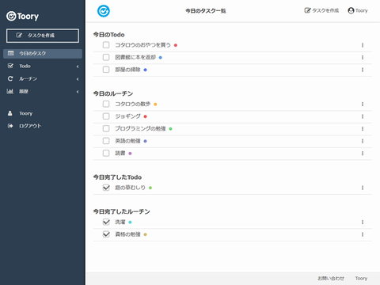

## 概要
タスク＆ルーチンワーク管理ツール



## CakePHPの導入
```
$ composer install
```

## 設定ファイルを編集
```
$ cp Config/env.php.sample Config/env.php
$ vim Config/env.php
```

## デプロイ
```
$ cp deploy.sh.sample deploy.sh
$ vim deploy.sh
$ ./deploy.sh
```

## DBマイグレーション
```
$ Vendor/bin/cake Migrations.migration run all
```